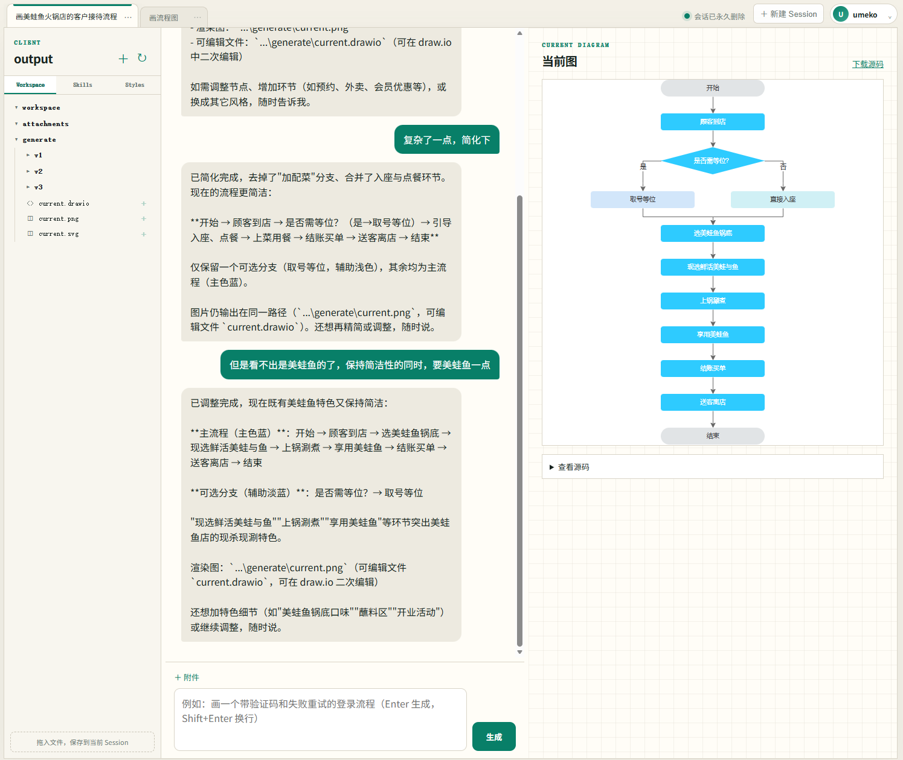
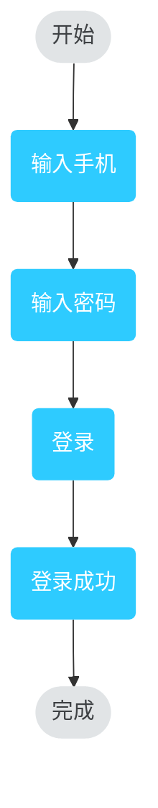

# Flowchart AI Agent

**用自然语言生成流程图/架构图的循环式 Agent**：生成 → 语法预检 → 渲染 → 多模态视觉验证 → 反馈修复，直到图真正画对为止。双出图引擎：**Mermaid**（mmdc 渲染）与 **drawio**（LLM 直出 draw.io 原生 XML，确定性布局，桌面版本地渲染，产物可二次编辑）。


## 一个交互式生成流程图的Agent



<details>
<summary>登录流程的输入文档与生成代码</summary>

输入（`test_datas/gen/1.txt` 节选）：

```
开始 → 输入手机 → 输入密码 → 登录 → 登录成功 → 完成
```

输出（`docs/images/case_login.mmd`）：


</details>

更多玩法：

- **对话修改**：`把登录改成验证码登录` —— 在现有图上修订，重走验证循环
- **贴图生成**：拖入手绘草图/现有流程图截图（`TEXT_MODEL_VISION=true`），模型看图作画；主模型无视觉能力时也不怕——`ocr_image` 工具用验证模型把素材图片里的文字和连接关系逐字提取出来再作画
- **工作文档**：素材多/需求杂时，Agent 会把各素材要点和初步生成方案整合成 `working_doc.md`（可用工具随时读写修改），再基于它生成，不把所有素材原文堆在对话里
- **流式输出**：模型回复与图表源码生成过程边产出边滚动显示
- **drawio 出图引擎**：`.env` 设 `OUTPUT_ENGINE=drawio` 并配置 `DRAWIO_PATH`（draw.io 桌面版路径），或会话中输入 `/engine drawio` / 直接说"切换到 drawio 模式"——LLM 直出 draw.io 原生 XML，坐标与走线由确定性布局器计算（流程图自动分支并排、直角正交走线；架构图组件严格等大、网格对齐），产物 `.drawio` 可导入 draw.io/Visio/亿图二次编辑。流程图/架构图按文档自动路由到两套提示词与布局管线
- **风格模板**：`styles/` 目录下每个 `.md` 文件就是一个风格插件，主 Agent 自己发现并按需选用；往目录丢一个 markdown 即可新增风格；`default.md` 始终生效，编辑它即可定制全局默认风格。模板中 `## [drawio:flowchart]` / `## [drawio:architecture]` 标记的段落是 drawio 引擎的专属规则，双引擎共用同一份色彩规范
- **风格生成 Agent**：现有模板都不满意时直接说"帮我做一个手绘风格的模板"，`create_style` 工具会自动起草风格插件、校验格式、试渲染，通过后写入 `styles/` 并立即启用
- **风格转换 Agent**：`换成深色风格`、`按这个文档调整风格` —— 只改样式层不改内容，骨架校验机械保证节点/连线/文字零改动；风格来源可以是现有模板（`style_name`）或口述/文档输入的风格要求（`style_document`）
- **技能包（Skill Packs）**：`skills/` 目录下每个带 frontmatter 的 `.md` 就是一个提示词型技能，主 Agent 遇到陌生领域任务时自己发现并遵照执行；从社区看到好用的 SKILL，丢进目录即可用。
- **文档检视**：说"检查这份文档/这张图"即可。检查路由把当前 Session 中 `kind: check` Skill 的完整执行协议交给唯一文件子 Agent；Core 只提供通用流式 `image_reasoning(prompt, image_paths)`，不再写死图片描述、检查项循环或 PASS/FAIL 判定。子 Agent 按 Skill 决定读取哪些文档、如何调用视觉模型及如何写 CSV。WebUI/TUI 把每次图像推理显示为可展开工具，Web 工具详情会实时刷新视觉模型推理和输出。批量任务先由短规划子 Agent 写 `batch_plan.json` 并退出，再逐案例启动独立检查，避免长文档和模型上下文跨案例累计。报告与批量计划位于 `output/generate/check_results/`、`output/generate/batch_plans/`。
- **文件读写**：主 Agent 与文件子 Agent 共用固定两级 tree 的 `list_dir`，并提供 `write_file` / `replace_in_file` / `grep_files` 等文件工具，可低成本了解批量素材目录结构后再查找或读取。Server 只搜索当前 Session 节点并向模型返回相对路径；TUI 保留本机绝对路径。子 Agent 工具回合默认上限为 24，可用 `MAX_SUBAGENT_TOOL_ITERATIONS` 调整
- **命令执行（冒险功能）**：用户明确要求时，主 Agent 可用 `run_command` 跑单行 shell 命令（格式转换、批量处理等）。每条命令默认红框展示、方向键选「是/否」确认，命令统一在产物目录下执行，执行中 Ctrl+C 直接杀掉进程；启动加 `--yolo` 或会话中输入 `/yolo` 可免确认（谨慎）

## 安装

> **不想装工具链？** 直接从 GitHub Release 下载离线包（内置 Node 与 mermaid-cli，
> 解压即用，只需系统 Chrome/Edge），见 [docs/DEPLOYMENT.md](docs/DEPLOYMENT.md) §2。
> Windows 包提供两个入口：`launcher.exe` 配置并启动 TUI，`launch_server.exe`
> 按 `.env` 的 `SERVER_*` 参数启动 Web/API 服务。

```bash
# 1) Python 依赖（推荐 uv，按 uv.lock 锁定版本；会自动创建 .venv）
uv sync
# 无 uv 时：python -m venv .venv && source .venv/bin/activate && pip install -r requirements.txt

# 2) Node.js ≥ 18（渲染与语法预检的运行时）
brew install node        # macOS；Windows 用官网安装包，内网离线装法见部署文档 §5.2

# 3) Mermaid 渲染器（全局安装，提供 mmdc 命令）
npm install -g @mermaid-js/mermaid-cli

# 4) 语法预检依赖（读取项目根目录 package.json，安装 mermaid + jsdom，
#    供 scripts/mermaid_parse.mjs 使用；可选但推荐，
#    跳过则自动退回纯 mmdc 校验，不影响主流程）
npm install

# 5) draw.io 桌面版（仅 drawio 引擎需要；下载安装后在 .env 配 DRAWIO_PATH）
#    https://github.com/jgraph/drawio-desktop/releases/latest
```

Windows 用户建议使用 Windows Terminal 或 VS Code 终端。

## 配置

```bash
cp .env.example .env
# 编辑 .env
```

`.env` 中各项含义见 `.env.example` 注释。模型 API 默认忽略系统代理并直连内网
`BASE_URL`；只有显式设置 `MODEL_PROXY` 时才会走指定代理。公司 Windows 环境 mmdc 因 puppeteer 自带
Chromium 不可用而报错时，设置 `CHROME_PATH` 指向本机 `chrome.exe`（或 Edge），工具会
自动生成 puppeteer 配置并用 `-p` 渲染，详见 `docs/DEPLOYMENT.md` §5.3。

出图引擎通过 `OUTPUT_ENGINE` 选择：`mermaid`（默认）或 `drawio`。drawio 引擎
**需要先安装 draw.io 桌面版**，官方下载地址：
<https://github.com/jgraph/drawio-desktop/releases/latest>（Windows 选
`draw.io-x.y.z-windows-installer.exe`，macOS 选对应芯片的 `.dmg`），装好后在
`.env` 的 `DRAWIO_PATH` 配置其可执行文件路径（Windows 默认
`C:\Program Files\draw.io\draw.io.exe`）。drawio 引擎产出可二次编辑的 `.drawio`
文件。会话中也可用 `/engine` 命令或对 Agent 说"切换引擎"随时切换。

字体规范（drawio 引擎）：`.env` 设 `DRAWIO_FONT_FAMILY` / `DRAWIO_FONT_SIZE` 即可
统一全图字体字号。字体文件无需手动安装——把 `.ttf/.otf` 放进项目根 `Fonts/` 目录，
启动时自动按当前用户注册（无需管理员；目录可用 `FLOWCHART_FONT_DIR` 覆盖）。

## 使用

```bash
# 交互模式（推荐）：口述需求或给文档路径，可持续对话修改
uv run flowchart-agent chat -o output

# 免确认执行 Agent 的 shell 命令（谨慎；会话中也可输入 /yolo 随时切换）
uv run flowchart-agent chat -o output --yolo

# 批处理模式：单文档 → 图，跑完退出（--style 指定 styles/ 目录中的风格模板）
uv run flowchart-agent run test_datas/gen/1.txt -o output
uv run flowchart-agent run test_datas/gen/1.txt -o output --style dark

# Web/API 服务（不提供 run_command；默认参数也可写入 .env 的 SERVER_* 配置）
uv run flowchart-agent server
# 命令行参数优先于 .env
uv run flowchart-agent server --host 0.0.0.0 --port 8765 -o output
```

启动后访问 <http://127.0.0.1:8765/>；Swagger 文档位于
<http://127.0.0.1:8765/docs>，版本化接口说明见 [`docs/API.md`](docs/API.md)。
Windows 离线包完成 `launcher.exe` 首次配置后，也可直接双击 `launch_server.exe`；
它会等待服务就绪并按 `SERVER_OPEN_BROWSER` 自动打开网页。

Web 提供登录、头像与用户设置、用户级 Session 管理、历史消息、上下文占用与手动压缩、附件、Skills/Styles 和文件树；主 Agent 还可把大文件检索、阅读、局部编辑和基于检查 Skill 的图片质检委派给单实例文件子 Agent，界面以紫色单独展示其工作过程；可预览
Markdown、XML/drawio、文本、PNG/JPEG/WebP 和 SVG。每个 Session 只可访问自己的
`workspace/`、`attachments/`、`generate/`、`check/`，Agent 文件工具同样受此边界约束。

**过程日志**：每次生成/修改的详细过程（触发动作、每轮生成/渲染/验证、每次 LLM
请求的耗时与规模、mmdc 命令）写入 `output/generate/v<n>/run.log`（run 模式为
`output/generate/run.log`）；Skill 驱动的检查报告写入
`output/generate/check_results/<case-id>/report.csv`，批量执行清单与汇总写入
`output/generate/batch_plans/`；chat 模式的全部工具调用另记于会话级
`output/chat.log`。

## 实现方案

主 Agent（文本 LLM + function calling）理解你的意图并调度 Skill，
子循环负责把图画对;语法预检不合法就修，视觉验证不通过就改，最多迭代若干轮后收敛。

详细设计见 [docs/REQUIREMENTS.md](docs/REQUIREMENTS.md)，部署见 [docs/DEPLOYMENT.md](docs/DEPLOYMENT.md)。

## 目录结构

```
flowchart_agent/
├── config.py            # dotenv 配置
├── images.py            # 图片校验与 base64 编码
├── llm/client.py        # OpenAI 兼容客户端
├── mermaid/extract.py   # 从 LLM 输出提取 Mermaid 代码
├── mermaid/render.py    # mmdc 渲染 + 快速预检
├── drawio/              # drawio 出图引擎（LLM 直出 draw.io XML → 确定性布局 → 桌面版渲染）
│   ├── xml.py           #   XML 提取与清洗
│   ├── layout.py        #   架构图布局器（层容器/子容器/组件网格）
│   ├── layout_flow.py   #   流程图布局器（分层 + 分支并排 + 直角走线规范化）
│   └── render.py        #   draw.io 桌面版 CLI 渲染
├── prompts/             # Prompt 模板包（按子 Agent 分文件）
│   ├── generate.py      #   生成/修复（mermaid 引擎）
│   ├── drawio.py        #   drawio 引擎生成/修复（架构图/流程图两套模板）
│   ├── verify.py        #   三档检视（双引擎共用）
│   ├── style.py         #   风格生成
│   ├── restyle.py       #   风格转换
│   ├── ocr.py           #   OCR 工具
│   ├── route.py         #   一级路由（生成/检查/闲聊）+ 图型二级路由（流程图/架构图）
│   └── check/           #   旧检查提示词（仅兼容旧执行器）
├── router.py            # 分类器（一级意图 + drawio 图型二级路由）
├── check/               # 旧检查执行器（兼容与解析测试；主检查路径由 Skill + image_reasoning 执行）
│   ├── items.py         #   解析 kind: check Skill 中的动态检查项
│   ├── classifier.py    #   旧二级分类兼容实现
│   ├── item_agent.py    #   旧 ItemCheckAgent 兼容实现
│   └── agent.py         #   旧 CheckAgent 兼容实现
├── agent.py             # 生成-渲染-验证子循环（双引擎）
├── style_agent.py       # 风格生成子 Agent
├── restyle_agent.py     # 风格转换子 Agent
├── session.py           # 会话状态（含出图引擎切换）
├── skills/              # 最小 Skill 抽象
│   ├── base.py          #   Skill 定义
│   └── builtin.py       #   20+1 个内置工具
├── skillpacks.py        # 技能包加载器（扫描 skills/*.md）
├── main_agent.py        # 主 Agent（含一级路由）
├── styles.py            # 风格插件加载器（扫描 styles/*.md，含引擎专属规则段）
├── runtime.py           # 冻结感知 + node/mmdc/浏览器解析（离线包 vendor）
├── tui_chips.py         # TUI 处理
├── chat_cli.py          # 交互式 REPL
└── cli.py               # 命令行入口
packaging/               # 离线包构建（主程序 + launcher.exe + launch_server.exe）
styles/                  # 作图风格插件（.md 文件，可自行新增）
scripts/
└── mermaid_parse.mjs    # Node 侧语法预检
docs/
├── REQUIREMENTS.md      # 开发需求文档
├── DEPLOYMENT.md        # 部署指南
```
