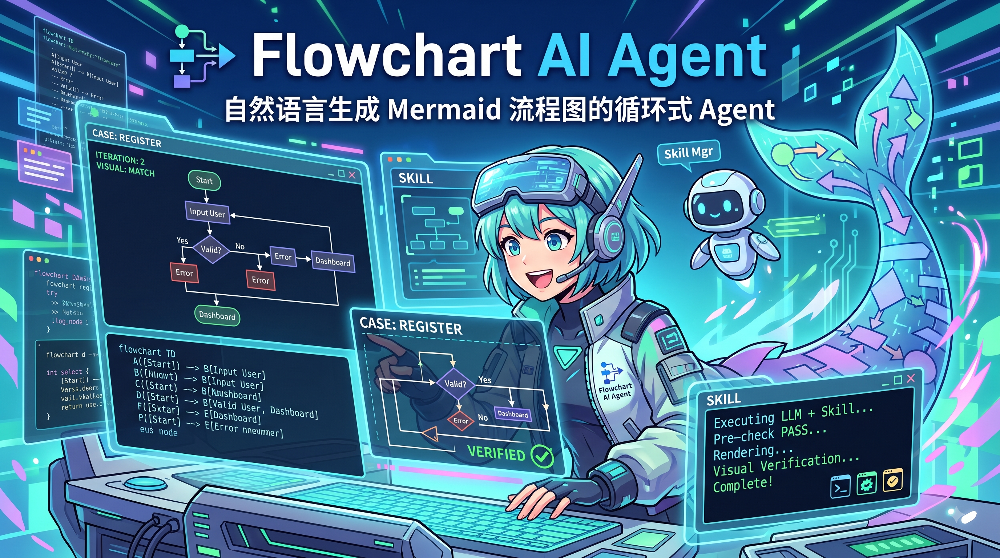
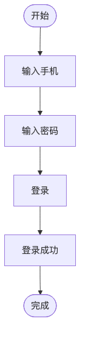
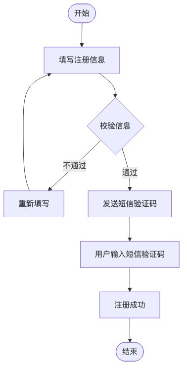
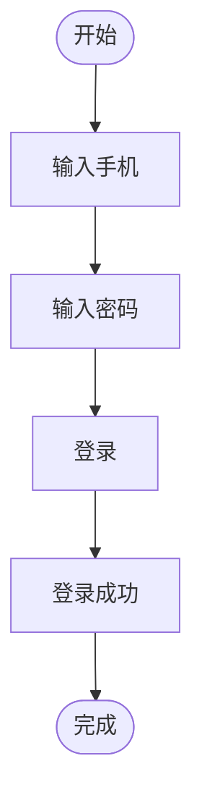

# Flowchart AI Agent

**用自然语言生成 Mermaid 流程图的循环式 Agent**：生成 → 语法预检 → mermaid-cli 渲染 → 多模态视觉验证 → 反馈修复，直到图真正画对为止。




## 效果示例

| 线性流程（登录） | 分支与回退（注册） |
| :---: | :---: |
|  |  |
| 输入：`test_datas/1.txt`，1 轮通过 | 含判断分支与回退循环，1 轮通过 |

<details>
<summary>登录流程的输入文档与生成代码</summary>

输入（`test_datas/1.txt` 节选）：

```
开始 → 输入手机 → 输入密码 → 登录 → 登录成功 → 完成
```

输出（`docs/images/case_login.mmd`）：


</details>

更多玩法：

- **对话修改**：`把登录改成验证码登录` —— 在现有图上修订，重走验证循环
- **贴图生成**：拖入手绘草图/现有流程图截图（`TEXT_MODEL_VISION=true`），模型看图作画
- **风格模板**：`styles/` 目录下每个 `.md` 文件就是一个风格插件（内置 default / dark），主 Agent 自己发现并按需选用；往目录丢一个 markdown 即可新增风格（格式见 `styles/README.md`）；`default.md` 始终生效，编辑它即可定制全局默认风格

## 安装

```bash
# 1) Python 依赖（推荐 uv，按 uv.lock 锁定版本；会自动创建 .venv）
uv sync
# 无 uv 时：python -m venv .venv && source .venv/bin/activate && pip install -r requirements.txt

# 2) Node.js ≥ 18（渲染与语法预检的运行时）
brew install node        # macOS；Windows 用官网安装包，内网离线装法见部署文档 §4.2

# 3) Mermaid 渲染器（全局安装，提供 mmdc 命令）
npm install -g @mermaid-js/mermaid-cli

# 4) 语法预检依赖（读取项目根目录 package.json，安装 mermaid + jsdom，
#    供 scripts/mermaid_parse.mjs 使用；可选但推荐，
#    跳过则自动退回纯 mmdc 校验，不影响主流程）
npm install
```

Windows 用户建议使用 Windows Terminal 或 VS Code 终端。

## 配置

```bash
cp .env.example .env
# 编辑 .env
```

## 使用

```bash
# 交互模式（推荐）：口述需求或给文档路径，可持续对话修改
uv run flowchart-agent chat -o output

# 批处理模式：单文档 → 图，跑完退出（--style 指定 styles/ 目录中的风格模板）
uv run flowchart-agent run test_datas/1.txt -o output
uv run flowchart-agent run test_datas/1.txt -o output --style dark
```

## 实现方案



上图就是本工具的工作方式：主 Agent（文本 LLM + function calling）理解你的意图并调度 Skill，
子循环负责把图画对——语法预检不合法就修，视觉验证不通过就改，最多迭代若干轮后收敛。

详细设计见 [docs/REQUIREMENTS.md](docs/REQUIREMENTS.md)，部署见 [docs/DEPLOYMENT.md](docs/DEPLOYMENT.md)。

## 目录结构

```
flowchart_agent/
├── config.py            # dotenv 配置
├── images.py            # 图片校验与 base64 编码
├── llm/client.py        # OpenAI 兼容客户端
├── mermaid/extract.py   # 从 LLM 输出提取 Mermaid 代码
├── mermaid/render.py    # mmdc 渲染 + 快速预检
├── prompts.py           # 生成/修复/验证 Prompt
├── agent.py             # 生成-渲染-验证子循环
├── session.py           # 会话状态
├── skills/              # 最小 Skill 抽象
│   ├── base.py          #   Skill 定义
│   └── builtin.py       
├── main_agent.py        # 主 Agent
├── styles.py            # 风格插件加载器（扫描 styles/*.md）
├── tui_chips.py         # TUI 处理
├── chat_cli.py          # 交互式 REPL
└── cli.py               # 命令行入口
styles/                  # 作图风格插件（.md 文件，可自行新增）
scripts/
└── mermaid_parse.mjs    # Node 侧语法预检
docs/
├── REQUIREMENTS.md      # 开发需求文档
├── DEPLOYMENT.md        # 部署指南
```
