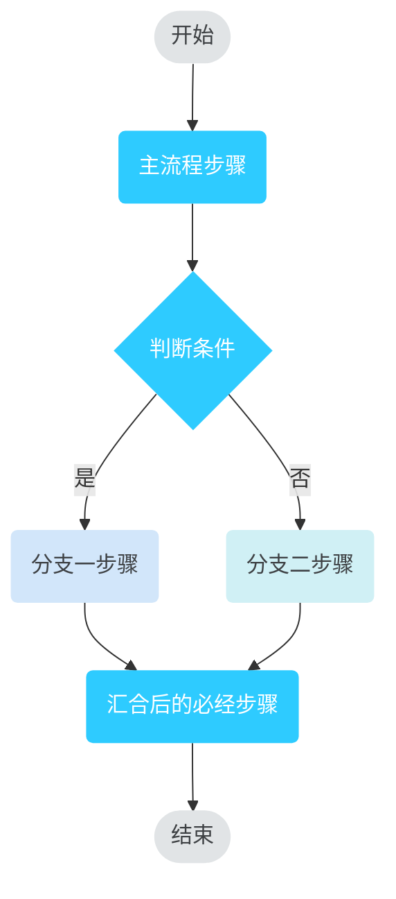
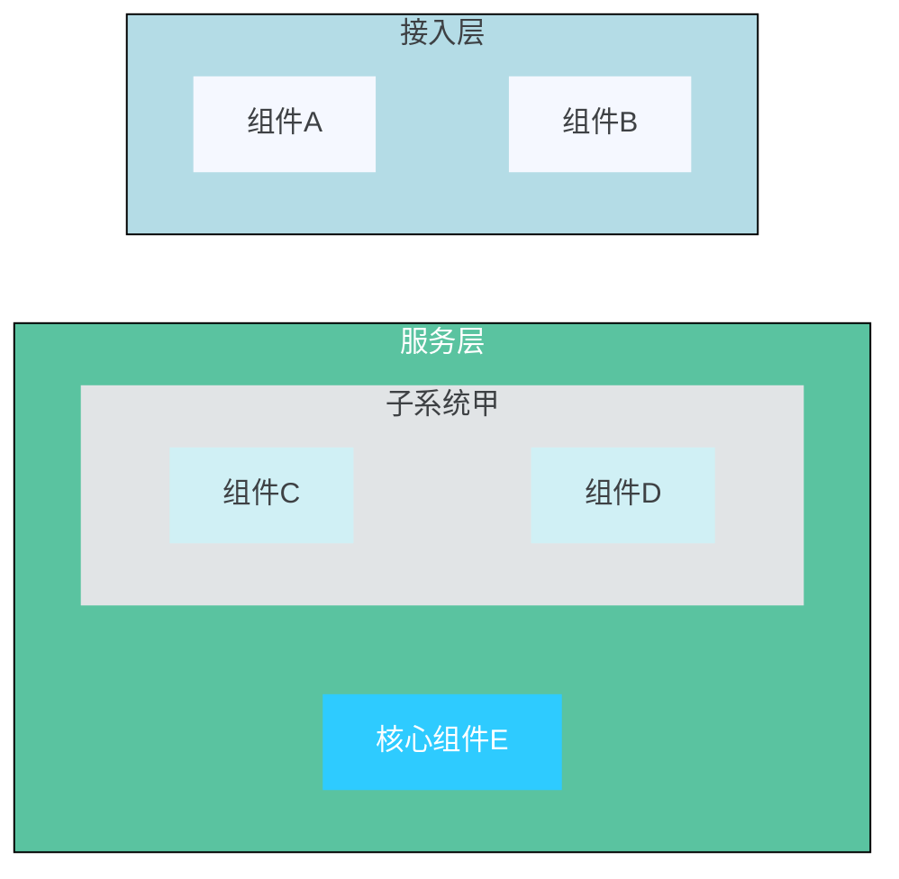

# 华为绘图规范（Huawei Drawing Standard）

本规范适用于产品架构图、流程图、组网图等各类技术示意图。所有矢量绘图工具（如 Visio、Draw.io、Adobe Illustrator）均应遵循以下颜色、线型、尺寸及文字标准。

---

## 1. 色彩规范（Color Palette）

### 1.1 主色调（Primary Colors）
| 用途 | RGB 值 | 色块示例 | 备注 |
|------|--------|----------|------|
| 主色（亮蓝） | `46 / 203 / 255` | ![ #2ECBFF]| 用于主要色块 |
| 辅助主色（淡蓝） | `210 / 230 / 250` | ![ #D2E6FA]| 用于次要模块 |

### 1.2 辅助色调（Secondary Colors）
| 用途 | RGB 值 | 色块示例 |
|------|--------|----------|
| 辅助色1（青绿） | `90 / 195 / 160` | ![ #5AC3A0] |
| 辅助色2（浅青） | `208 / 240 / 245` | ![ #D0F0F5] |
| 辅助色3（灰蓝） | `180 / 220 / 230` | ![ #B4DCE6] |
| 辅助色4（极淡蓝） | `245 / 248 / 255` | ![ #F5F8FF] |

### 1.3 文字颜色（Text Colors）
| 背景类型 | 推荐文字 RGB | 色块示例 | 说明 |
|----------|--------------|----------|------|
| **白色/透明背景**（原理图、白底图） | 主文字：`62 / 65 / 68`（深灰）<br>次要文字：`102 / 102 / 102`（中灰） | ![ #3E4144] ![#666666] | 确保对比度，优先使用 ` #3E4144` 作为正文 |
| **深色/黑色背景**（PPT、视频封面等） | **纯白色** `255 / 255 / 255` | ![ #FFFFFF] | 所有文字统一使用白色 |

### 1.4 边框 / 线条颜色（Border & Line）
| 用途 | RGB 值 | 色块示例 |
|------|--------|----------|
| 所有线条、边框、箭头轮廓 | `102 / 102 / 102` | ![ #666666] |

### 1.5 其他可选配色（辅助背景/分割）
| 用途 | RGB 值 | 色块示例 |
|------|--------|----------|
| 浅灰填充/分割线 | `225 / 228 / 230` | ![ #E1E4E6] |
| 极浅背景 | `248 / 248 / 248` | ![ #F8F8F8] （全局背景） |

---

## 2. 绘图元素规范（Graphic Elements）

### 2.1 背景颜色（Global Background）
- **所有架构图、流程图、组网图**的默认背景色统一为：  
  `RGB: 248 / 248 / 248`（即 `#F8F8F8`）

### 2.2 线条与边框（Lines & Borders）
| 属性 | 规范 |
|------|------|
| **线粗** | 统一为 **0.75 pt**（磅） |
| **颜色** | `RGB: 102 / 102 / 102`（`#666666`） |
| **线型** | 实线表示**可见/具体**的轮廓或界线；<br>虚线表示**隐藏/被遮挡**但确实存在的轮廓界线；<br>**灵活使用**：实线与虚线并非绝对，应服从表达意图，只要能清晰传达即可。 |

### 2.3 色块（Shapes）
#### 2.3.1 产品架构图色块
- **角型**：**直角**（无圆角）
- **填充颜色**：使用主色调 `RGB: 45 / 203 / 255`（注：规范中写 45，与主色 46 接近，请以 46 为准，实际取 `#2ECBFF`）
- 若色块内需放置文字，文字颜色遵循 **1.3 文字颜色** 规则（白底用深灰，黑或深色底用白色）。

#### 2.3.2 流程图 / 组网图色块
- **角型**：**圆角**，倒角半径 **0.1 cm**
- **填充颜色**：可使用主色或辅助色，但必须保证文字可读。
- **深色色块**上的文字必须使用 **白色**（`#FFFFFF`）。

---

## 3. 线条与箭头（Arrows）

### 3.1 实线箭头（已知流向）
| 属性 | 规范 |
|------|------|
| 线粗 | 0.75 pt |
| 线条颜色 | `RGB: 102 / 102 / 102` |
| 箭头填充颜色 | **黑色**（` #000000`） |
| 箭头样式 | 实心箭头（实） |

### 3.2 虚线箭头（未知或可变流向）
| 属性 | 规范 |
|------|------|
| 线粗 | 0.75 pt |
| 线条颜色 | `RGB: 102 / 102 / 102` |
| 箭头填充颜色 | `RGB: 102 / 102 / 102`（与线同色） |
| 箭头样式 | 实心箭头（虚线线型） |

---

## 5. 注意事项

(暂无)

---

## 6. Mermaid 实现规则（生成代码时必须严格遵守）

本规范落地到 Mermaid 代码时，按以下规则执行，优先级高于通用作图习惯：

### 6.1 流程图节点形状
- **起止节点**（开始/结束）：体育场形 `id([文字])`；
- **处理节点**：圆角矩形 `id(文字)`——流程图色块为 0.1cm 圆角（见 2.3.2），
  **禁止使用直角矩形 `id[文字]`**；
- **判断节点**：菱形 `id{文字}`。

### 6.2  流程图节点配色：主流程 vs 分支（classDef）
所有流程框**只有填充色、无边框**。在 `flowchart` 声明行之后**原样加入**以下
classDef 定义，并用 `:::类名` 给每个节点分配类别：

```mermaid
classDef terminal fill:#E1E4E6,color:#3E4144,stroke-width:0
classDef required fill:#2ECBFF,color:#FFFFFF,stroke-width:0
classDef optional fill:#D2E6FA,color:#3E4144,stroke-width:0
classDef optional2 fill:#D0F0F5,color:#3E4144,stroke-width:0
```

- **terminal**（浅灰 ` #E1E4E6` + 深灰字）：开始、结束节点，不用蓝色；
- **required**（主色蓝 ` #2ECBFF` + **白字**）：**主流程**步骤——从开始到
  结束的必经路径，含判断节点（菱形）本身；蓝色填充属深色底，文字必须
  白色（见 1.3）；
- **optional / optional2**（浅色辅助色 + 深灰字）：判断节点引出的**分支
  路径**节点、可选步骤（如留言、等待、可跳过的邀约等）——分支不是必经
  路径，**不要涂主色蓝**；一条分支用 `optional`（淡蓝 ` #D2E6FA`），
  存在多条并列分支时第二条用 `optional2`（浅青 ` #D0F0F5`），让不同
  分支一眼可区分；
- 分支汇合回到主流程后，其后的必经步骤恢复 required；
- 连线/箭头保持主题默认灰色 ` #666666`，**不要**写 `linkStyle` 或额外 `style` 语句。

### 6.3 示例骨架



### 6.4 架构图画法

- 6.1-6.3 的形状与必选/可选规则**仅适用于流程图**；架构图按本节执行；
- **形状**：色块一律用**直角**矩形 `id[文字]`（见 2.3.1）；用 `subgraph
  L["层级名"]` 表达分层/分组，默认不画层间箭头（见下方"连线"规则），
  无判断节点与分支标签，不使用 terminal 样式；
- **边框**：**只有最外层架构框（subgraph 容器）用黑色边框**包裹；内层的
  文字框（组件色块）和嵌套子容器一律**无边框**（仅填充）；
- **配色**：只从主色与辅助色中选取，不要使用其它颜色——**文字框（组件
  色块）用浅色调辅助色**，**架构框（subgraph 分区容器）用深色调辅助色**，
  相邻层级的容器必须不同色。在 `flowchart` 声明行之后**原样加入**以下
  classDef（同层组件同色，可按层换色；注意 stroke-width:0 即无边框）：

```mermaid
classDef arc1 fill:#F5F8FF,color:#3E4144,stroke-width:0
classDef arc2 fill:#D0F0F5,color:#3E4144,stroke-width:0
classDef arc3 fill:#D2E6FA,color:#3E4144,stroke-width:0
classDef arc4 fill:#E1E4E6,color:#3E4144,stroke-width:0
classDef arcCore fill:#2ECBFF,color:#FFFFFF,stroke-width:0
```

- **每个文字框都必须分配 arc 类**，不要留未分类节点——未分类节点会落成
  主题默认的蓝底深灰字，不符合规范；
- **深色填充必须用白字**：文字框确需用深色强调时（如核心组件），只能用
  `arcCore`（主色蓝 `#2ECBFF` + 白字）；浅色填充一律深灰字 `#3E4144`；
- **嵌套子容器的背景色必须与其内部组件色块明显不同**（推荐子容器用
  `#E1E4E6` 浅灰、内部组件用 `#F5F8FF`/`#D0F0F5` 等），禁止子容器与
  内部组件同色——同色会导致组件融进背景无法区分；
- 架构框（subgraph）用 `style` 语句上**深色辅助色**背景 + **黑色边框**
  （`stroke:#000000`），灰蓝 `#B4DCE6`（深灰标题字 `color:#3E4144`）与
  青绿 `#5AC3A0`（白色标题字 `color:#FFFFFF`）按层交替；嵌套的子容器
  只上浅辅助色背景、不加黑边：

```mermaid
style L1 fill:#B4DCE6,color:#3E4144,stroke:#000000
style L2 fill:#5AC3A0,color:#FFFFFF,stroke:#000000
```

- **连线**：架构图默认**不画层间箭头**；层级之间用隐形链保持纵向堆叠顺序
  （`L1 ~~~ L2`，不可见但能防止各层被乱序摊开）。仅当文档明确表达调用/
  数据流方向时，才画可见箭头（`L1 --> L2`）；
- **布局**（避免细长或矮胖，整体宽高比接近 4:3）：
  - 整体 `flowchart TD`，层级纵向堆叠；
  - 每个 subgraph 内写 `direction LR`，**且组件必须用隐形链串联**
    （`A["组件1"] ~~~ B["组件2"] ~~~ C["组件3"]`）——Mermaid 中孤立节点的
    direction 不生效，不串联组件会被竖排成细长条；
  - 单层组件超过 4 个时拆成多条隐形链（多行排列），不要竖成一列。

### 6.5 架构图示例骨架



**注意**：classDef 只是定义，每个组件节点必须用 `:::arcN` 或 `class` 语句
实际分配颜色，只写 classDef 定义而不分配等于没配色；嵌套子容器（如
L2a）的背景色必须与其内部组件色块不同。

---

## [drawio:flowchart] draw.io 流程图规则

本节是 drawio 引擎画**流程图**时的落地规则（对应 6.1-6.3 的 Mermaid 规则），
配色数值与上方色彩规范一致：

- **形状**（style 串的关键字段，其余照抄系统骨架）：
  - 起止节点（开始/结束）：`rounded=1;arcSize=50`（跑道形/胶囊形），
    不要用椭圆；
  - 处理节点：`rounded=1`（圆角矩形，对应 2.3.2 的 0.1cm 圆角），
    **禁止直角矩形 `rounded=0`**；
  - 判断节点：`rhombus`（菱形）；
- **配色**（所有节点**只有填充、无边框**：`strokeColor=none`）：
  - 起止节点：`fillColor=#E1E4E6`（浅灰）+ `fontColor=#3E4144`，不用蓝色；
  - 主流程步骤（含判断节点本身）：`fillColor=#2ECBFF`（主色蓝）+
    `fontColor=#FFFFFF`（深色底必须白字，见 1.3）；
  - 判断引出的分支路径节点：**不涂主色蓝**——第一条分支
    `fillColor=#D2E6FA`（淡蓝），并列的第二条分支 `fillColor=#D0F0F5`
    （浅青），均 `fontColor=#3E4144`，让不同分支一眼可区分；
  - 分支汇合回到主流程后，其后的必经步骤恢复主色蓝；
- **连线**：一律直角正交走线、颜色 `#666666`，箭头实心；分支连线带
  标签文字（是/否等），标签 `fontColor=#3E4144`；
- 除上述颜色外不要使用其它颜色。

## [drawio:architecture] draw.io 架构图规则

本节是 drawio 引擎画**架构图**时的落地规则（对应 6.4 的 Mermaid 规则）：

- **层容器**：整块纯色填充的矩形（不要用 swimlane 标题栏样式），层名
  居中显示在色块顶部；灰蓝 `fillColor=#B4DCE6`（标题字 `#3E4144`）与
  青绿 `fillColor=#5AC3A0`（标题字 `#FFFFFF`）按层交替；
  **只有最外层层容器带黑色边框** `strokeColor=#000000`；
- **子容器**（层内分组，最多一层）：浅灰 `fillColor=#E1E4E6`、
  **无边框**（`strokeColor=none`），标题字 `#3E4144`；
- **组件**：**同一层内所有组件必须使用同一种浅色**，从 `#F5F8FF` /
  `#D0F0F5` / `#D2E6FA` / `#E1E4E6` 中选一种；**相邻层的组件浅色必须
  不同**——颜色用来区分层级，同层不同色显得杂乱；组件文字一律
  `#3E4144`、**无边框**（`strokeColor=none`）；
- 组件**不允许使用任何强调色**（包括主色蓝 `#2ECBFF`）：同层组件颜色
  必须完全一致，没有例外；
- **子容器的背景色必须与其内部组件的浅色明显不同**（子容器用 `#E1E4E6`
  时，内部组件用 `#F5F8FF`/`#D0F0F5` 等），禁止同色——同色会导致组件
  融进背景无法区分；
- 架构图默认**不画任何连线/箭头**，只靠层容器堆叠表达分层。
